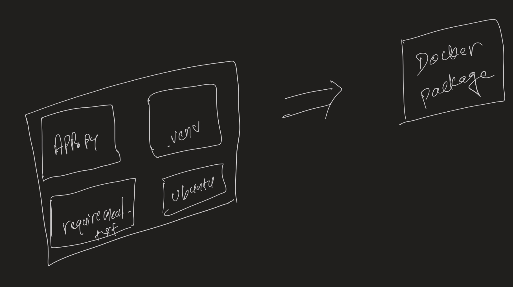

# Introduction to docker

## Introduction

  
What is docker

  
  - Docker is a virtualization software that allows packaging of application along with its runtime, dependencies and configuration files into a singe docker package.
  - The docker package could be easily distributed and could be executed regardless of os on docker runtime environment

  

  
Why do we need docker

  - In order to develop 

  

